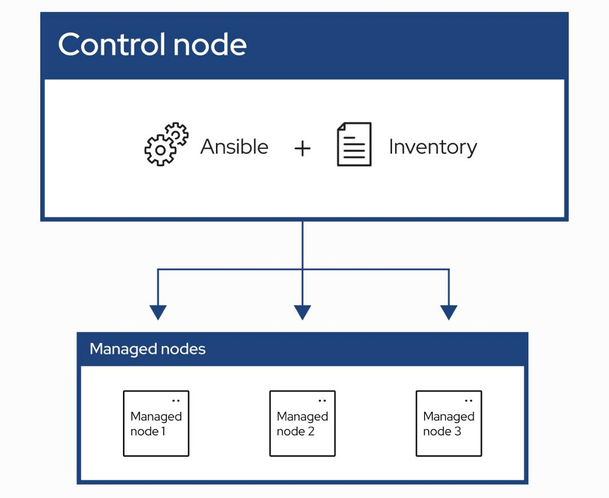

# Getting Started With Ansible
Ansible automates the management of remote systems and controls their desired state.

As shown in the preceding figure, most Ansible environments have three main components:
## Control node

``
ansible --version
``
> Step 3 CREATE KEY PAIR